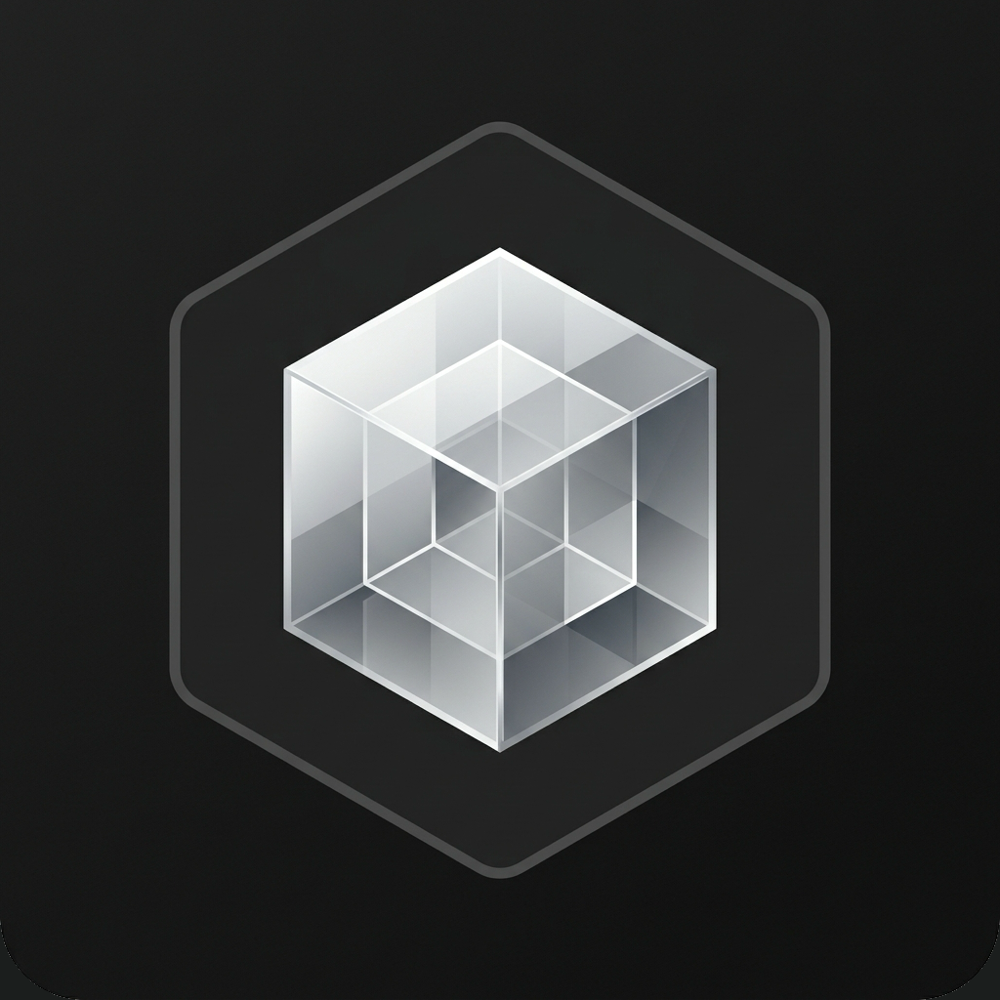

<div align="center">



# LMForge

**Hardware-aware LLM inference orchestrator — from edge to server**

[](https://github.com/phoenixtb/lmforge/releases)
[](https://github.com/phoenixtb/lmforge/actions/workflows/ci.yml)
[](LICENSE)
[](#supported-platforms)

Run multiple LLMs simultaneously on your local hardware.  
LMForge is a persistent daemon that manages model loading, VRAM allocation, and engine selection automatically — then exposes a single OpenAI-compatible REST API to every app on your machine.

[**Install**](#install) · [**Quick Start**](#quick-start) · [**CLI Reference**](#cli-reference) · [**REST API**](#rest-api) · [**Model Catalog**](#model-catalog) · [**Developer Guide**](#developer-guide) · [**Contributing**](#contributing)

</div>

---

## What is LMForge?

LMForge is a **local AI infrastructure layer**. It sits between your hardware and the tools that consume AI (code editors, agents, custom scripts, REST clients), managing the messy reality of running LLMs locally:

- Which engine to use for your hardware (Apple MLX, SGLang, llama.cpp)?
- How much VRAM is available, and which models fit right now?
- What happens when you want a chat model *and* an embedding model loaded at once?
- How do you keep everything running when apps open and close?

LMForge answers all of this transparently. Consumer apps see a simple OpenAI-compatible API; LMForge handles the rest.

### Architecture

```
┌─────────────────────────────────────────────────────┐
│  LMForge Core (daemon)                              │
│  • Runs as a system service — always available      │
│  • Starts at login, survives app closures           │
│  • REST API at http://127.0.0.1:11430               │
│  • Manages model lifecycle, VRAM, engine selection  │
└────────────────────┬────────────────────────────────┘
                     │ HTTP  (OpenAI-compatible API)
       ┌─────────────┼──────────────┐
       │             │              │
  LMForge UI    Your IDE       Any Client
  (Tauri app)  (Copilot,    (curl, Python,
               Continue)     LangChain…)
```

This is the **Docker model**: the engine is a service, the UI is just a client. Closing the desktop app never stops your models.

---

## Features

- **Multi-model orchestration** — run inference *and* embedding models simultaneously, each independently managed with its own keep-alive lifecycle
- **Hardware-aware engine selection** — automatically picks the best engine:
  - 🍎 **Apple Silicon** → [oMLX](https://github.com/jundot/omlx) — OpenAI-compatible server, runs natively on Metal via MLX
  - 🖥️ **NVIDIA GPU (Linux/Windows)** → [SGLang](https://github.com/sgl-project/sglang) — CUDA, high-concurrency
  - 💻 **CPU / any hardware** → [llama.cpp](https://github.com/ggerganov/llama.cpp) — universal cross-platform fallback
- **VRAM-aware LRU eviction** — loads models up to detected VRAM budget; evicts least-recently-used when full
- **OpenAI-compatible API** — `/v1/chat/completions`, `/v1/embeddings`, `/v1/models`, `/v1/rerank`
- **Ollama-compatible API** — `/api/chat`, `/api/generate`, `/api/tags` for tools that expect Ollama
- **Model catalog** — curated shortcut names (`family:size:quant`) resolving to the right HuggingFace repo and format for your hardware automatically
- **System service on all platforms** — launchd (macOS), systemd user unit (Linux), Windows Scheduled Task — all via `lmforge service install`, no admin required
- **Real-time telemetry** — live GPU/CPU/memory metrics, per-model RSS, request latency, request counts
- **Desktop UI** — optional Tauri app with model browser, hardware panel, and live metrics dashboard
- **Idempotent CLI** — `lmforge start` is safe to call from any script; no-ops if already running

---

## Supported Platforms

| Platform | Architecture | Engine | Core | Desktop UI |
|---|---|---|---|---|
| macOS 13+ | Apple Silicon (arm64) | oMLX (Metal/MLX) | ✅ | ✅ DMG |
| Ubuntu 22.04+ | x86_64 | SGLang / llama.cpp | ✅ | ✅ AppImage |
| Ubuntu 22.04+ | arm64 | llama.cpp | ✅ | 🔜 Planned |
| Windows 11 | x86_64 | llama.cpp / SGLang | ✅ | ✅ NSIS installer |

> **macOS Intel (x86_64)** binaries are available but not currently published via the CI release pipeline. Build from source with `cargo build --release --target x86_64-apple-darwin`.

---

## Install

### Core (daemon + CLI)

The daemon runs as a system service. Install once; it starts automatically on every login.

**macOS / Linux:**
```bash
curl -fsSL https://github.com/phoenixtb/lmforge/releases/latest/download/install-core.sh | bash
```

**Windows** — download `lmforge-windows-x86_64.exe` from [Releases](https://github.com/phoenixtb/lmforge/releases/latest), place it on your `PATH`, then:
```powershell
lmforge init                   # detect hardware, install engine
lmforge service install        # register Scheduled Task (auto-starts at logon)
```

What the install script does on macOS/Linux:
1. Downloads the pre-built binary for your platform/arch
2. Installs to `/usr/local/bin/lmforge`
3. Runs `lmforge init` — detects hardware, selects and installs the right engine
4. Registers a system service (`launchd` on macOS, `systemd --user` on Linux)
5. Starts the daemon immediately

To pin a specific version:
```bash
LMFORGE_VERSION=v0.1.0 curl -fsSL https://github.com/phoenixtb/lmforge/releases/latest/download/install-core.sh | bash
```

### Desktop UI (optional)

Install the core first, then:

**macOS / Linux:**
```bash
curl -fsSL https://github.com/phoenixtb/lmforge/releases/latest/download/install-ui.sh | bash
```

**Windows:** Download `LMForge-UI-windows-x86_64.exe` from [Releases](https://github.com/phoenixtb/lmforge/releases/latest) and run the installer. WebView2 (pre-installed on Windows 11) is the only requirement.

The UI is a pure client — closing it never affects the daemon or running models.

### Uninstall

```bash
# Remove the desktop UI only (daemon keeps running)
curl -fsSL https://github.com/phoenixtb/lmforge/releases/latest/download/uninstall-ui.sh | bash

# Remove Core (stops daemon; keeps your downloaded models)
curl -fsSL https://github.com/phoenixtb/lmforge/releases/latest/download/uninstall-core.sh | bash

# Remove everything including models
curl -fsSL https://github.com/phoenixtb/lmforge/releases/latest/download/uninstall-core.sh | bash -s -- --purge
```

**Windows:**
```powershell
lmforge service uninstall      # remove Scheduled Task
# then delete lmforge.exe from PATH
```

---

## Quick Start

Model shortcuts follow the format **`family:size:quant`** (and optionally **`:variant`**).  
The same shortcut resolves to the correct format for your hardware — MLX on Apple Silicon, GGUF everywhere else.

```bash
# 1. Install core
curl -fsSL https://github.com/phoenixtb/lmforge/releases/latest/download/install-core.sh | bash

# 2. Pull a model using its catalog shortcut
lmforge pull qwen3:8b:4bit

# 3. Interactive chat via CLI
lmforge run qwen3:8b:4bit

# 4. Or hit the API directly
curl http://127.0.0.1:11430/v1/chat/completions \
  -H "Content-Type: application/json" \
  -d '{
    "model": "qwen3:8b:4bit",
    "messages": [{"role": "user", "content": "Hello!"}]
  }'

# 5. Embeddings
curl http://127.0.0.1:11430/v1/embeddings \
  -H "Content-Type: application/json" \
  -d '{"model": "nomic-embed-text:v1.5", "input": "Hello world"}'
```

---

## CLI Reference

```
lmforge <command> [options]
```

| Command | Description |
|---|---|
| `lmforge init` | Probe hardware, select engine, install if needed |
| `lmforge start` | Start the daemon (idempotent — safe to call if already running) |
| `lmforge stop` | Gracefully stop the daemon |
| `lmforge status` | Show engine status, loaded models, and VRAM usage |
| `lmforge pull <model>` | Download a model (catalog shortcut, HF repo, or local path) |
| `lmforge run <model>` | Interactive REPL with a model |
| `lmforge catalog` | List all model shortcuts |
| `lmforge catalog --search <keyword>` | Search the catalog |
| `lmforge models list` | List installed models with sizes and capabilities |
| `lmforge models remove <name>` | Remove a model from disk |
| `lmforge models unload` | Unload active model from VRAM (keeps files) |
| `lmforge logs` | View daemon logs |
| `lmforge logs -f` | Tail logs continuously |
| `lmforge clean` | Audit disk usage (orphans, logs, HF cache) |
| `lmforge clean --all --yes` | Clean everything without prompts |
| `lmforge service install` | Register as a system service (auto-start on login) |
| `lmforge service uninstall` | Remove the system service |
| `lmforge service start` | Start the registered service |
| `lmforge service stop` | Stop the registered service |
| `lmforge service status` | Show service registration and daemon reachability |

### Service Management

LMForge registers a native service on every platform — no admin/root required:

| Platform | Mechanism | Config location |
|---|---|---|
| macOS | launchd user agent | `~/Library/LaunchAgents/com.lmforge.daemon.plist` |
| Linux | systemd user unit | `~/.config/systemd/user/lmforge.service` |
| Windows | Scheduled Task (At Logon) | Task Scheduler → `LMForge Daemon` |

---

## REST API

LMForge exposes two API surfaces on `http://127.0.0.1:11430`:

### OpenAI-compatible (`/v1/*`)

Drop-in replacement for any tool built on the OpenAI SDK:

```bash
export OPENAI_API_BASE=http://127.0.0.1:11430/v1
export OPENAI_API_KEY=none    # no key required
```

| Endpoint | Method | Description |
|---|---|---|
| `/v1/models` | GET | List available models |
| `/v1/chat/completions` | POST | Chat completion (streaming + non-streaming) |
| `/v1/completions` | POST | Text completion |
| `/v1/embeddings` | POST | Generate embeddings (batched, auto-chunked) |
| `/v1/rerank` | POST | Rerank documents |

### Ollama-compatible (`/api/*`)

For tools that target Ollama (Open WebUI, Continue, etc.):

| Endpoint | Method | Description |
|---|---|---|
| `/api/chat` | POST | Chat generation |
| `/api/generate` | POST | Text generation |
| `/api/tags` | GET | List installed models |

### LMForge-native (`/lf/*`)

| Endpoint | Method | Description |
|---|---|---|
| `/health` | GET | Health check |
| `/lf/status` | GET | Engine state snapshot |
| `/lf/status/stream` | GET | SSE stream of state changes |
| `/lf/hardware` | GET | Detected hardware (GPU, CPU, VRAM, engine) |
| `/lf/sysinfo` | GET | Live system metrics (GPU%, VRAM, CPU, RAM) |
| `/lf/model/list` | GET | Installed models with sizes and capabilities |
| `/lf/model/pull` | POST | Download a model (SSE progress stream) |
| `/lf/model/switch` | POST | Load a model into VRAM |
| `/lf/model/unload` | POST | Unload a model from VRAM |
| `/lf/model/delete/{name}` | DELETE | Remove a model from disk |
| `/lf/config` | GET | Current runtime configuration |
| `/lf/shutdown` | POST | Graceful daemon shutdown |

---

## Model Catalog

LMForge includes a curated catalog of shortcut names that resolve to the right HuggingFace repo and quantisation format for your hardware automatically.

Shortcuts follow the pattern **`family:size:quant`** (with an optional **`:variant`** suffix for special builds):

```
qwen3:8b:4bit               # Qwen3 8B, 4-bit quantization
gemma3:4b:4bit              # Gemma 3 4B, 4-bit
nomic-embed-text:v1.5       # Nomic embedding, version 1.5
qwen3-reranker:0.6b:q4      # Qwen3 Reranker 0.6B, Q4 quant
llama4:17b:4bit:scout       # Llama 4 Scout variant
```

```bash
lmforge catalog                    # list all shortcuts
lmforge catalog --search qwen      # search by name/family
```

### Chat / Instruction Models

| Shortcut | macOS (MLX) | Linux / Windows (GGUF) |
|---|---|---|
| `qwen3:8b:4bit` | `mlx-community/Qwen3-8B-4bit` | `bartowski/Qwen3-8B-GGUF` |
| `qwen3.5:2b:4bit` | `mlx-community/Qwen3.5-2B-4bit` | `Qwen/Qwen3.5-2B-GGUF` |
| `qwen3.5:4b:4bit` | `mlx-community/Qwen3.5-4B-4bit` | `Qwen/Qwen3.5-4B-GGUF` |
| `qwen3.5:9b:4bit` | `mlx-community/Qwen3.5-9B-OptiQ-4bit` | `bartowski/Qwen3.5-9B-OptiQ-GGUF` |
| `gemma3:1b:4bit` | `mlx-community/gemma-3-1b-it-4bit` | `bartowski/gemma-3-1b-it-GGUF` |
| `gemma3:4b:4bit` | `mlx-community/gemma-3-4b-it-4bit` | `bartowski/gemma-3-4b-it-GGUF` |
| `gemma3:12b:4bit` | `mlx-community/gemma-3-12b-it-4bit` | `bartowski/gemma-3-12b-it-GGUF` |
| `gemma4:e4b:4bit` | `mlx-community/gemma-4-e4b-it-4bit` | `bartowski/gemma-4-e4b-it-GGUF` |
| `llama3.1:8b:4bit` | `mlx-community/Meta-Llama-3.1-8B-Instruct-4bit` | `bartowski/Meta-Llama-3.1-8B-Instruct-GGUF` |
| `llama4:17b:4bit:scout` | `mlx-community/Llama-4-Scout-17B-16E-Instruct-4bit` | `bartowski/Llama-4-Scout-17B-16E-Instruct-GGUF` |
| `phi4:4b:4bit` | `mlx-community/Phi-4-mini-instruct-4bit` | `bartowski/Phi-4-mini-instruct-GGUF` |
| `deepseek_r1:8b:4bit:distill-qwen` | `mlx-community/DeepSeek-R1-Distill-Qwen-8B-4bit` | `unsloth/DeepSeek-R1-Distill-Qwen-8B-GGUF` |

### Embedding Models

| Shortcut | macOS (MLX) | Linux / Windows (GGUF) |
|---|---|---|
| `nomic-embed-text:v1.5` | `mlx-community/nomic-embed-text-v1.5-mlx` | `nomic-ai/nomic-embed-text-v1.5-GGUF` |
| `nomic-modernbert-embed:4bit` | `mlx-community/nomicai-modernbert-embed-base-4bit` | — |
| `nomic-modernbert-embed:f16` | — | `nomic-ai/nomic-modernbert-embed-base-GGUF` |
| `snowflake-arctic-embed-l:v2:4bit` | `mlx-community/snowflake-arctic-embed-l-v2.0-4bit` | — |
| `qwen3-embed:0.6b:4bit` | `mlx-community/Qwen3-Embedding-0.6B-4bit-DWQ` | `Qwen/Qwen3-Embedding-0.6B-GGUF` |
| `qwen3-embed:4b:4bit` | `mlx-community/Qwen3-Embedding-4B-4bit-DWQ` | `Qwen/Qwen3-Embedding-4B-GGUF` |
| `bge-m3:f16` | — | `gpustack/bge-m3-GGUF` |

### Re-ranking Models (llama.cpp only)

| Shortcut | GGUF Repo |
|---|---|
| `bge-reranker-v2-m3:f16` | `gpustack/bge-reranker-v2-m3-GGUF` |
| `bge-reranker:large:f16` | `gpustack/bge-reranker-large-GGUF` |
| `jina-reranker-v2:f16` | `gpustack/jina-reranker-v2-base-multilingual-GGUF` |
| `qwen3-reranker:0.6b:q4` | `Qwen/Qwen3-Reranker-0.6B-GGUF` |
| `qwen3-reranker:4b:q4` | `Qwen/Qwen3-Reranker-4B-GGUF` |

> **Re-ranking** requires llama.cpp with `--reranking`. The `/v1/rerank` endpoint returns 501 on oMLX and SGLang.

You can also pull any HuggingFace repo directly by its full path:

```bash
lmforge pull mlx-community/Qwen3-8B-4bit
lmforge pull bartowski/Qwen3-8B-GGUF
```

---

## Configuration

Global config file: `~/.lmforge/config.toml`

```toml
schema_version = 2

port          = 11430
bind_address  = "127.0.0.1"
log_level     = "info"

[resources]
max_gpu_memory_fraction  = 0.75   # fraction of VRAM available to LMForge
max_concurrent_requests  = 4
request_queue_size       = 32
min_free_disk_gb         = 10

[orchestrator]
keep_alive        = "5m"          # unload idle models after this duration
max_loaded_models = 0             # 0 = unlimited (bounded by VRAM)
embed_batch_size  = 32            # max inputs per engine call for /v1/embeddings
```

Per-directory overrides via `lmforge.yaml`:

```yaml
default_chat_model: qwen3:8b:4bit
default_embed_model: nomic-embed-text:v1.5
```

CLI flags override config:

```bash
lmforge start --port 8080 --log-level debug
```

---

## Building from Source

**Requirements:** Rust 1.78+, Node.js 20+ (UI only)

```bash
git clone https://github.com/phoenixtb/lmforge
cd lmforge

# Build the CLI/daemon
cargo build --release
./target/release/lmforge init

# Build the desktop UI
cd ui && npm install && npm run tauri build
```

**Run tests:**
```bash
cargo test                              # unit + mock integration tests
bash tests/multi_model_e2e.sh          # E2E multi-model test suite
```

---

## Developer Guide

This section covers everything you need to develop, debug, and fully clean up a local LMForge installation.

### Prerequisites

| Tool | Min version | Purpose |
|---|---|---|
| Rust | 1.78 | Core daemon + CLI |
| Node.js | 20 | Desktop UI (SvelteKit) |
| npm | 10 | UI package manager |
| Tauri CLI | 2.x | Desktop UI bundler |
| Homebrew | any | macOS: oMLX engine install |

```bash
# Install Tauri CLI (once)
cargo install tauri-cli --version "^2" --locked
```

---

### Local Development Setup

#### 1 — Clone and build the daemon

```bash
git clone https://github.com/phoenixtb/lmforge
cd lmforge

# Debug build (fast compile, verbose logging)
cargo build

# Release build (optimized)
cargo build --release
```

The compiled binary is at `target/debug/lmforge` or `target/release/lmforge`.

#### 2 — Initialise hardware detection

```bash
# Detect hardware, install the right engine, write ~/.lmforge/config.toml
./target/debug/lmforge init
```

This is idempotent — safe to re-run after engine upgrades.

#### 3 — Run the daemon in the foreground (preferred for debugging)

```bash
# Runs in the foreground; Ctrl-C to stop
# Logs go to stdout at whatever level is set in config
./target/debug/lmforge start

# Override log level without editing config
RUST_LOG=debug ./target/debug/lmforge start

# Use a different port (e.g. to avoid clashing with an installed daemon)
./target/debug/lmforge start --port 11431
```

#### 4 — Quick smoke-tests while the daemon is running

```bash
curl http://127.0.0.1:11430/health
curl http://127.0.0.1:11430/lf/status | jq .
curl http://127.0.0.1:11430/lf/hardware | jq .
```

---

### Desktop UI Development

The UI is a SvelteKit app wrapped in Tauri. There are two ways to run it:

#### Hot-reload dev server (recommended)

```bash
# Terminal 1 — daemon must be running first
./target/debug/lmforge start

# Terminal 2 — Tauri dev mode (hot-reloads on every file save)
cd ui
npm install          # first time only
npm run tauri dev
```

The Tauri shell connects to the Vite dev server on `http://localhost:1420`. Svelte component changes auto-reload without restarting the daemon.

#### Vite-only (browser, no Tauri APIs)

```bash
cd ui
npm run dev
# Opens http://localhost:1420 in your browser
```

Note: Tauri-specific features (system tray, dialog picker, native events) are unavailable in the browser — use `npm run tauri dev` for full fidelity.

#### Build the production bundle

```bash
cd ui
npm run tauri build
# Outputs: ui/src-tauri/target/release/bundle/
```

---

### Useful `cargo` Invocations

```bash
# Check for compile errors without producing a binary (very fast)
cargo check

# Lint (treat warnings as errors — same as CI)
cargo clippy -- -D warnings

# Format
cargo fmt

# Run only unit tests (no engine required)
cargo test --lib

# Run integration tests (daemon is started and stopped by the harness)
cargo test --test integration

# Run the Rust multi-model orchestration test suite
cargo test --test multi_model

# Run tests with output (don't suppress println!)
cargo test -- --nocapture

# Watch mode (requires cargo-watch)
cargo watch -x check
cargo watch -x 'test --lib'
```

---

### Testing

#### Unit tests

Live alongside the source in `src/**/*.rs`:

```bash
cargo test --lib
```

#### Integration tests (Rust harness)

`tests/integration.rs` and `tests/multi_model.rs` start a real daemon, run requests, and validate responses. They require the engine to be installed (`lmforge init` must have run).

```bash
cargo test --test integration
cargo test --test multi_model
```

To run a single test by name:

```bash
cargo test --test integration -- embed_roundtrip --nocapture
```

#### End-to-end shell tests

```bash
# Single model smoke test
bash tests/e2e.sh

# Full multi-model orchestration suite (generates JSON + Markdown reports)
bash tests/multi_model_e2e.sh
# Reports saved to: tests/integration/reports/
```

#### Testing with a custom catalog

```bash
# Point to a local catalog directory for testing new shortcuts
./target/debug/lmforge start --catalog-dir ./data/catalogs
```

---

### Environment Variables

| Variable | Default | Effect |
|---|---|---|
| `RUST_LOG` | `info` | Log verbosity: `error`, `warn`, `info`, `debug`, `trace` |
| `LMFORGE_CONFIG` | `~/.lmforge/config.toml` | Override config file path |
| `LMFORGE_DATA_DIR` | `~/.lmforge` | Override the entire data directory |
| `LMFORGE_PORT` | `11430` | Override the API port |

---

### Runtime Data Layout

Everything LMForge writes at runtime lives in `~/.lmforge/`:

```
~/.lmforge/
├── config.toml          # User configuration (editable)
├── hardware.json        # Cached hardware probe result
├── models.json          # Index of all downloaded models + metadata
├── lmforge.pid          # PID of the running daemon (deleted on clean stop)
├── models/              # Downloaded model weights (one dir per model)
│   ├── qwen3.5-4b-4bit/
│   └── …
├── engines/             # Installed engine binaries managed by LMForge
│   └── (oMLX, llama.cpp, etc.)
├── bin/                 # LMForge helper binaries (e.g. GPU probe)
│   └── lmforge-gpu-probe-aarch64-apple-darwin
└── logs/                # Daemon log files
    └── lmforge.log
```

---

### Full Cleanup (Development Reset)

The commands below progressively remove LMForge artifacts. **Models are large** — remove them explicitly only when you intend to.

#### Stop the daemon

```bash
# Graceful stop (if running via service)
lmforge service stop

# Or kill the foreground process with Ctrl-C

# Or kill by PID
kill $(cat ~/.lmforge/lmforge.pid 2>/dev/null) 2>/dev/null
```

#### Remove the system service (if registered)

```bash
# macOS
launchctl unload ~/Library/LaunchAgents/com.lmforge.daemon.plist 2>/dev/null
rm -f ~/Library/LaunchAgents/com.lmforge.daemon.plist

# Linux
systemctl --user stop lmforge 2>/dev/null
systemctl --user disable lmforge 2>/dev/null
rm -f ~/.config/systemd/user/lmforge.service
systemctl --user daemon-reload
```

#### Remove the installed binary

```bash
# Installed via install-core.sh
rm -f /usr/local/bin/lmforge

# Or if installed via cargo install
cargo uninstall lmforge
```

#### Remove the desktop UI

```bash
# macOS — drag LMForge.app from /Applications to Trash, or:
rm -rf /Applications/LMForge.app

# Linux AppImage
rm -f ~/Applications/LMForge*.AppImage
```

#### Remove runtime data (config, logs, model index, engine binaries)

```bash
# Keeps downloaded models — just cleans state files and engines
rm -f ~/.lmforge/config.toml
rm -f ~/.lmforge/hardware.json
rm -f ~/.lmforge/models.json
rm -f ~/.lmforge/lmforge.pid
rm -rf ~/.lmforge/engines/
rm -rf ~/.lmforge/bin/
rm -rf ~/.lmforge/logs/
```

#### Remove downloaded models

```bash
# ⚠ This deletes all model weights — they must be re-downloaded
rm -rf ~/.lmforge/models/

# Or remove one specific model
rm -rf ~/.lmforge/models/qwen3.5-4b-4bit/
```

#### Purge everything

```bash
# Complete wipe — removes all models, config, engines, logs
rm -rf ~/.lmforge/
```

#### Clean Cargo build artefacts

```bash
# Removes target/ — frees several GB; next build takes longer
cargo clean

# Clean only the UI node_modules and dist
cd ui
rm -rf node_modules .svelte-kit build
```

#### Quick dev reset (no model loss)

Stop daemon → remove state files → rebuild → reinit:

```bash
kill $(cat ~/.lmforge/lmforge.pid 2>/dev/null) 2>/dev/null || true
rm -f ~/.lmforge/models.json ~/.lmforge/hardware.json ~/.lmforge/lmforge.pid
cargo build
./target/debug/lmforge init
./target/debug/lmforge start
```

---

## Data & Privacy

LMForge runs **entirely on your machine**. There is no telemetry, no analytics, no cloud sync. Models are downloaded directly from HuggingFace to `~/.lmforge/models/` and inference runs locally. The API binds to `127.0.0.1` by default and is never exposed to the network.

---

## Contributing

Contributions are welcome. Please:

1. **Open an issue first** for significant changes — discuss the approach before coding
2. Fork the repo and create a feature branch from `main`
3. Write tests for new functionality (unit tests in `src/`, integration tests in `tests/`)
4. Ensure `cargo fmt`, `cargo clippy`, and `cargo test` all pass
5. Submit a PR with a clear description of what changed and why

### Project Structure

```
lmforge/
├── src/
│   ├── cli/           # CLI subcommands (start, stop, pull, service, …)
│   ├── config/        # Configuration loading and merging
│   ├── engine/        # Engine adapters (oMLX, llama.cpp, SGLang) + manager
│   │   └── adapters/
│   ├── hardware/      # GPU/CPU/memory probing
│   ├── model/         # Model index, resolver, catalog
│   └── server/        # Axum HTTP server, OpenAI/Ollama/LF route handlers
├── data/
│   └── catalogs/      # mlx.json, gguf.json — shortcut → HF repo mappings
├── ui/
│   ├── src/           # SvelteKit frontend
│   └── src-tauri/     # Tauri shell (HTTP client — no daemon code)
├── tests/             # Integration test suite (Rust + shell)
├── scripts/           # Install / uninstall scripts
└── .github/workflows/ # CI (ci.yml) and release (release.yml) pipelines
```

### Opening Issues

- **Bug reports**: include `lmforge status`, `lmforge logs --tail 50`, and your OS/hardware
- **Feature requests**: describe the use case, not just the solution
- **Model compatibility**: include the model repo URL and the error from `lmforge logs`

---

## License

MIT — see [LICENSE](LICENSE).

---

<div align="center">


Made for developers who want local AI to work like infrastructure —  
always on, always fast, never in the way.

**[phoenixtb/lmforge](https://github.com/phoenixtb/lmforge)**

</div>
