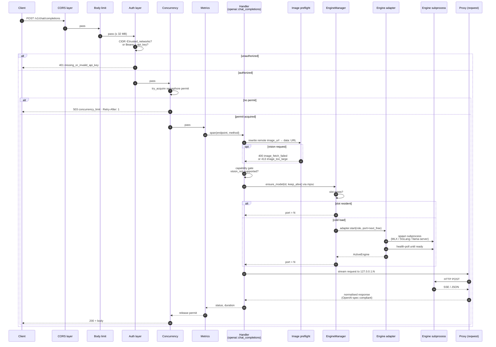
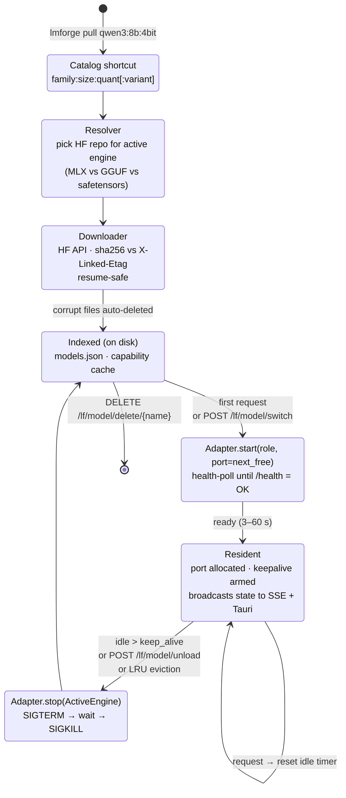

# LMForge Architecture

This document describes the actual runtime architecture of LMForge derived from the
source tree (`src/cli`, `src/server`, `src/engine`, `src/hardware`, `src/model`,
`src/config`). The README diagram is a simplified mental model; the diagrams below
are the source of truth.

The same three diagrams are exported for use in external documentation
(e.g. the portfolio product page). Export commands are at the bottom.

---

## 1. System architecture

The daemon is a single Rust binary that hosts an `axum` HTTP server, an
`EngineManager` that spawns and supervises **engine subprocesses** (one per
loaded model), and a `ModelIndex` over the on-disk model store. Clients of
every flavour speak HTTP to the daemon on `127.0.0.1:11430` — the daemon
proxies their requests to the appropriate engine subprocess.

```mermaid
flowchart LR
    %% ── Clients ──
    subgraph Clients["Clients"]
        UI["LMForge Desktop UI<br/>(Tauri + SvelteKit)"]
        IDE["IDE plugins<br/>Continue · Copilot-compatible"]
        APP["Custom apps<br/>curl · Python · LangChain"]
        DOC["DocIntel<br/>(downstream service)"]
    end

    %% ── Daemon process ──
    subgraph Daemon["LMForge Daemon — single Rust process on 127.0.0.1:11430"]
        direction TB

        subgraph HTTP["HTTP surface (axum Router)"]
            V1["/v1/* — OpenAI-compatible<br/>chat · completions · embeddings · rerank · models"]
            API["/api/* — Ollama-compatible<br/>chat · generate · tags"]
            LF["/lf/* — Native<br/>status · hardware · sysinfo · model/* · logs · config"]
            HM["/health · /metrics<br/>(auth-bypass)"]
            UIMOUNT["/ui — embedded SvelteKit"]
        end

        subgraph MW["Middleware chain (tower layers, outer → inner)"]
            direction LR
            CORS["CORS"] --> BODY["DefaultBodyLimit<br/>32 MB default"]
            BODY --> AUTH["Auth<br/>Bearer + CIDR<br/>trusted_networks"]
            AUTH --> CONC["Concurrency<br/>semaphore<br/>503 on overflow"]
            CONC --> MET["Metrics span<br/>(Prometheus)"]
        end

        subgraph Core["Orchestration core"]
            MGR["EngineManager<br/>slot table · ManagerCommand mpsc<br/>broadcast(status) → SSE + Tauri"]
            IDX["ModelIndex<br/>models.json<br/>capability cache"]
            KA["Keepalive tracker<br/>(skipped on oMLX — native LRU)"]
            HW["Hardware probe<br/>OS · arch · GPU · VRAM"]
            CAT["Catalog resolver<br/>family:size:quant → HF repo"]
            DL["Downloader<br/>HF + sha256 verify"]
            IPF["Image preflight<br/>URL → data: URL rewrite"]
            THK["Thinking workflow<br/>two-call budget orchestrator"]
        end
    end

    %% ── Engine subprocesses ──
    subgraph Engines["Engine subprocesses (one process per loaded model, proxied via reqwest)"]
        OMLX["oMLX server<br/>(Metal / MLX)<br/>Apple Silicon"]
        SGL["SGLang server<br/>(CUDA)<br/>Linux NVIDIA"]
        LCP["llama-server<br/>(CPU + CUDA)<br/>universal fallback"]
    end

    %% ── Storage ──
    subgraph Store["~/.lmforge"]
        CFG["config.toml"]
        MDLS["models/<br/>weights · mmproj · tokenizer"]
        MIDX["models.json"]
        LOGS["logs/<br/>daemon + per-model"]
        PIDS["engines/<br/>PID files"]
    end

    %% ── External ──
    HF[(HuggingFace Hub)]

    Clients --> HTTP
    HTTP --> MW
    MW --> Core
    MGR -- spawn / supervise --> Engines
    MGR <-- proxy (reqwest) --> Engines
    Core --- Store
    DL --> HF
    Engines -. inference .- Engines

    classDef daemon fill:#1a1b2e,stroke:#8b5cf6,color:#f0f0f3
    classDef engine fill:#10121a,stroke:#60a5fa,color:#f0f0f3
    classDef store fill:#0b0d14,stroke:#5c6370,color:#9ca3b0
    classDef client fill:#0b0d14,stroke:#a78bfa,color:#f0f0f3
    class UI,IDE,APP,DOC client
    class OMLX,SGL,LCP engine
    class CFG,MDLS,MIDX,LOGS,PIDS store
```



### Key invariants

- **One engine subprocess per loaded model.** Each gets a unique TCP port
  (`base_engine_port` + slot index). The daemon proxies HTTP to it.
- **No model is preloaded.** Cold-load (3–60 s) is paid on first request,
  unless the operator opted into `[orchestrator] auto_load = [...]` or a
  consumer explicitly warmed via `POST /lf/model/switch`.
- **Engine choice is hardware-driven, not user-configured.** `hardware::detect()`
  picks the adapter at daemon start; users get a single OpenAI API regardless
  of what's underneath.

---

## 2. Request lifecycle

What happens between an HTTP `POST /v1/chat/completions` and the bytes
streaming back. The same flow applies to embeddings and reranking with a
different terminal handler.



### Engine routing notes

- The proxy normalises engine quirks (strip `null` `reasoning_content`,
  inject missing `logprobs:null`, etc.) so clients see strict OpenAI shape.
- The `thinking_budget` path goes through `server/thinking.rs` and issues
  **two** proxied calls to the same engine port (reasoning phase then answer
  phase with `enable_thinking: false`).
- Streaming responses (`stream: true`) hold the semaphore permit for the
  full duration of the stream — that's why `max_concurrent_requests` caps
  *active inference*, not "request rate".

---

## 3. Model lifecycle

How a catalog shortcut (`qwen3:8b:4bit`) becomes a running inference port.



### Lifecycle notes

- **Memory budget** is accelerator-aware (`engine::manager::evict_for_memory`):
  discrete GPU / unified memory use live free VRAM (`hardware::vram::get_free_vram`);
  CPU-only hosts use safety-first admission control
  (`hardware::vram::cpu_residency_free`) — the **tighter** of (a) live `available`
  RAM minus an OS reserve, and (b) a hard total-RAM footprint cap minus the
  summed estimate of resident models. The manager evicts the LRU slot when a new
  load wouldn't fit. CPU-only must not budget on VRAM (0 there); and budgeting on
  *total* RAM alone over-committed and OOM'd the host. On memory-tight machines
  (8 GB-class) this returns less than a model's need, so models run **sequentially**
  (evict-then-load) rather than co-resident — `tests/multi_model_e2e.sh --no-burst`
  exercises that path (all capabilities checked, no parallel/co-resident probes).
- **Active-aware eviction + admission control** (uniform across GPU and CPU). Each
  slot carries an in-flight counter (`ActiveSlot.inflight`): the orchestrator bumps
  it when a model is ensured `for_request`, and the request path's
  `server::InflightGuard` decrements it on completion (including streaming-body
  drop / client disconnect, via `attach_inflight_guard`). Eviction (`lru_idle_model_id`),
  the `max_loaded_models` cap, and the keep-alive TTL sweep **only ever drop idle
  slots** (`inflight == 0`) — a model serving a request is never torn down. If a
  cold load can't fit after evicting every idle slot, it is **rejected** (`503`,
  `Insufficient memory…`) instead of OOM'ing the host or killing live work; the
  caller retries once a model goes idle.
- **oMLX note.** LMForge still spawns **one `omlx serve` process per loaded model
  slot** (same as llama.cpp), each pointing at the shared models parent dir.
  oMLX's in-process model LRU does **not** replace LMForge's slot TTL — idle
  slots are unloaded after `keep_alive` (default 5m) like every other engine.
  A longer-term fix is a single shared oMLX server for all models (efficiency
  workstream).
- **`max_loaded_models = 0`** in config means unlimited — VRAM is the only
  cap. Setting it to a fixed N caps concurrent residency regardless of VRAM.
- **Slot keys are model ids**, not repos. Pulling the same repo under two
  shortcuts gives two slots.

---

## Exporting diagrams

GitHub renders these inline. For external use (portfolio site, slide decks,
README banners), export Diagram 1 to SVG.

### Option A — Mermaid Live Editor (no setup)

1. Copy the ```` ```mermaid ```` block above into <https://mermaid.live>.
2. **Actions → SVG** (or **PNG**). Save as `lmforge_arch.svg`.

### Option B — `mmdc` (CLI, requires Node)

```bash
# One-shot, no global install:
npx -p @mermaid-js/mermaid-cli mmdc \
  -i docs/architecture/ARCHITECTURE.md \
  -o docs/architecture/lmforge_arch.svg \
  -t dark \
  -b transparent
```

`mmdc` exports every fenced mermaid block; pass `-i` with `--pdfFit` and
`-o ...svg` to get a single SVG per diagram (`-2.svg`, `-3.svg` suffixed).

### Where the exported SVG lives

The portfolio site keeps a hand-tuned SVG at
`titas-portfolio/static/images/projects/lmforge/lmforge_arch.svg` so the
visual identity matches the rest of the product page. Re-export when this
document changes; the diagram-as-code is the source of truth.
